# CI/CD ファームウェア戦略

## ❌ CIから直接書き込みできない理由

### 物理的制約
- CI環境（GitHub Actions等）は**物理デバイスにアクセスできない**
- Xiao BLEは物理的にUSB接続が必要
- ブートローダーモード（リセットボタン2回押し）が必要

### セキュリティ制約
- CIランナーにUSBデバイスを接続することはセキュリティリスク
- 物理デバイスの状態管理が困難

## ✅ CI/CDでできること

### 1. ファームウェアのビルド
```yaml
# .github/workflows/firmware-build.yml
name: Firmware Build

on: [push, pull_request]

jobs:
  build:
    runs-on: ubuntu-latest
    steps:
      - uses: actions/checkout@v3
      - name: Setup PlatformIO
        run: pip install platformio
      - name: Build firmware
        run: |
          cd firmware
          pio run
      - name: Upload artifacts
        uses: actions/upload-artifact@v3
        with:
          name: firmware-binaries
          path: |
            firmware/.pio/build/**/firmware.uf2
            firmware/.pio/build/**/firmware.hex
```

### 2. UF2/HEXファイルの生成
- ✅ コンパイル済みバイナリの生成
- ✅ GitHub Releasesへの自動アップロード
- ✅ バージョン管理とタグ付け

### 3. Arduino IDEスケッチの検証
```yaml
- name: Arduino CLI Build
  run: |
    arduino-cli core install Seeeduino:nrf52
    arduino-cli compile --fqbn Seeeduino:nrf52:xiaonRF52840Sense firmware/arduino_version/xiao_keyboard
```

## 🔄 推奨ワークフロー

### 開発フロー

```mermaid
graph LR
    A[コード変更] --> B[GitHub Push]
    B --> C[CI Build]
    C --> D[UF2生成]
    D --> E[Release作成]
    E --> F[手動ダウンロード]
    F --> G[ローカル書き込み]
```


### 1. CI/CDでの自動化部分
- ✅ **ファームウェアビルド**
- ✅ **テスト実行**
- ✅ **UF2ファイル生成**
- ✅ **GitHub Releases作成**
- ✅ **バージョンタグ付け**

### 2. 手動実行部分
- 📱 **UF2ファイルダウンロード**
- 📱 **Xiao BLEをブートローダーモード**
- 📱 **ドラッグ&ドロップで書き込み**

## 🚀 効率的なデプロイ方法

### 方法1: GitHub Releasesから直接ダウンロード

1. **GitHub Releasesページ**にアクセス
2. **最新のファームウェアUF2**をダウンロード
3. **Xiao BLEをブートローダーモード**に
4. **UF2ファイルをドラッグ&ドロップ**

### 方法2: 自動ダウンロードスクリプト

```bash
#!/bin/bash
# download_latest_firmware.sh

# 最新リリースのUF2ファイルをダウンロード
curl -s https://api.github.com/repos/USERNAME/SmartphoneKeyboardConnector/releases/latest \
  | grep "browser_download_url.*uf2" \
  | cut -d '"' -f 4 \
  | xargs curl -L -o xiao-keyboard-latest.uf2

echo "Latest firmware downloaded: xiao-keyboard-latest.uf2"
echo "1. Connect Xiao BLE to USB"
echo "2. Double-press reset button (green LED blinking)"
echo "3. Drag and drop xiao-keyboard-latest.uf2 to XIAO-SENSE drive"
```

### 方法3: 開発者向け高速デプロイ

```bash
#!/bin/bash
# quick_deploy.sh

echo "Building and deploying firmware..."

# ローカルビルド
cd firmware
pio run

# UF2ファイルの確認
if [ -f ".pio/build/xiao_nrf52840_sense/firmware.uf2" ]; then
    echo "✅ Firmware built successfully"
    echo "📱 Ready to flash:"
    echo "   1. Double-press Xiao reset button"
    echo "   2. Drag firmware.uf2 to XIAO-SENSE drive"
    open .pio/build/xiao_nrf52840_sense/
else
    echo "❌ Build failed"
    exit 1
fi
```

## 🎯 プロダクション配布戦略

### エンドユーザー向け
1. **GitHub Releases**で安定版を配布
2. **Installation Guide**で書き込み手順を説明
3. **Video Tutorial**で実演

### 開発者向け
1. **Arduino IDE環境**での開発
2. **PlatformIO環境**での高度な開発
3. **CI/CD**での自動ビルド・テスト

## 🔧 CI設定例

### GitHub Actions設定

```yaml
# .github/workflows/firmware-release.yml
name: Firmware Release

on:
  push:
    tags:
      - 'v*'

jobs:
  build-and-release:
    runs-on: ubuntu-latest
    steps:
      - uses: actions/checkout@v3

      - name: Setup PlatformIO
        run: |
          pip install platformio

      - name: Build Firmware
        run: |
          cd firmware
          pio run

      - name: Prepare Release Files
        run: |
          mkdir release
          cp firmware/.pio/build/**/firmware.uf2 release/xiao-keyboard-firmware.uf2
          cp firmware/.pio/build/**/firmware.hex release/xiao-keyboard-firmware.hex

      - name: Create Release
        uses: actions/create-release@v1
        env:
          GITHUB_TOKEN: ${{ secrets.GITHUB_TOKEN }}
        with:
          tag_name: ${{ github.ref }}
          release_name: Firmware ${{ github.ref }}
          body: |
            ## 📱 Installation
            1. Download `xiao-keyboard-firmware.uf2`
            2. Connect Xiao BLE to computer
            3. Double-press reset button (green LED blinking)
            4. Drag UF2 file to XIAO-SENSE drive

      - name: Upload Release Assets
        # UF2とHEXファイルをリリースに添付
```

## 💡 まとめ

### CIの役割
- ✅ **自動ビルド**
- ✅ **品質チェック**
- ✅ **リリース管理**

### 手動の役割
- 📱 **物理デバイスへの書き込み**
- 📱 **動作確認**
- 📱 **トラブルシューティング**

**結論**: CIは開発効率を上げるが、最終的なデバイスへの書き込みは手動で行う必要があります。